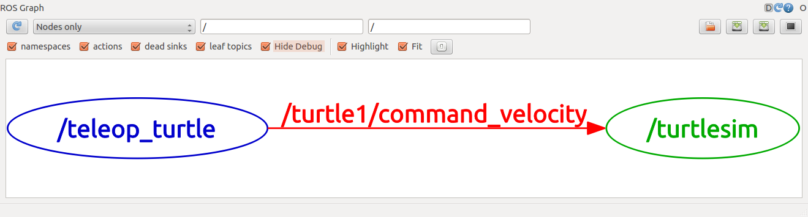

# Step 6. ROS Topics

## 1. Setup
Run roscore in a new terminal
```
$ roscore
```

Run turtlesim in another new terminal
```
$ rosrun turtlesim turtlesim_node
```
Run turtle keyboard teleoperation in another new terminal to drive the turtle around
```
$ rosrun turtlesim turtle_teleop_key
```

## 2. ROS Topics
**turtlesim_node** and **turtle_teleop_key** node are communicating with each other over a ROS Topic

* turtle_teleop_key is **publishing** the key strokes on a topic 
* while turtlesim **subscribes** to the same topic to receive the key strokes.

### rqt_graph
In a new terminal, run:
```
$ rosrun rqt_graph rqt_graph
```
 
Nodes: <span style="color:blue">Blue</span> and <span style="color:green">green</span>
