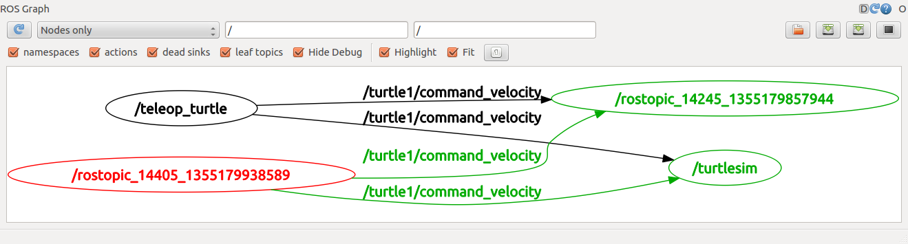

# Step 6. ROS Topics

## 1. Setup
Run roscore in a new terminal
```
$ roscore
```

Run turtlesim in another new terminal
```
$ rosrun turtlesim turtlesim_node
```
Run turtle keyboard teleoperation in another new terminal to drive the turtle around
```
$ rosrun turtlesim turtle_teleop_key
```

## 2. ROS Topics
**turtlesim_node** and **turtle_teleop_key** node are communicating with each other over a ROS Topic

* turtle_teleop_key is **publishing** the key strokes on a topic 
* while turtlesim **subscribes** to the same topic to receive the key strokes.

### rqt_graph
In a new terminal, run:
```
$ rosrun rqt_graph rqt_graph
```
 
Nodes: Blue and gree
Topic:  Red

### rostopic
The rostopic tool allows you to get information about ROS topics. 
```
$ rostopic -h
Commands:
	rostopic bw	display bandwidth used by topic
	rostopic delay	display delay of topic from timestamp in header
	rostopic echo	print messages to screen
	rostopic find	find topics by type
	rostopic hz	display publishing rate of topic    
	rostopic info	print information about active topic
	rostopic list	list active topics
	rostopic pub	publish data to topic
	rostopic type	print topic type
```

### rostopic echo
rostopic echo shows the data published on a topic. 

Usage:
```
rostopic echo [topic]
```
 The command velocity data published by the turtle_teleop_key node. 
 ```
$ rostopic echo /turtle1/cmd_vel
 ```
 Check at rqt_graph again, rostopic echo (red), is now also subscribed to the turtle1/command_velocity topic
  
 
### rostopic list
rostopic list returns a list of all topics currently subscribed to and published.
```
$ rostopic list -h
Usage: rostopic list [/namespace]

Options:
  -h, --help            show this help message and exit
  -b BAGFILE, --bag=BAGFILE
                        list topics in .bag file
  -v, --verbose         list full details about each topic
  -p                    list only publishers
  -s                    list only subscribers
  --host                group by host name
```
```
$ rostopic list -v

Published topics:
 * /turtle1/color_sensor [turtlesim/Color] 1 publisher
 * /turtle1/cmd_vel [geometry_msgs/Twist] 1 publisher
 * /rosout [rosgraph_msgs/Log] 2 publishers
 * /rosout_agg [rosgraph_msgs/Log] 1 publisher
 * /turtle1/pose [turtlesim/Pose] 1 publisher

Subscribed topics:
 * /turtle1/cmd_vel [geometry_msgs/Twist] 1 subscriber
 * /rosout [rosgraph_msgs/Log] 1 subscriber
```

## 3. ROS Messages
Communication on topics happens by sending ROS messages between nodes. For the publisher (turtle_teleop_key) and subscriber (turtlesim_node) to communicate, the publisher and subscriber must send and receive the same type of message. This means that a topic type is defined by the message type published on it. The type of the message sent on a topic can be determined using rostopic type. 

### rostopic type
rostopic type returns the message type of any topic being published.

Usage: 
```
rostopic type [topic]
```
Example:
```
$ rostopic type /turtle1/cmd_vel
geometry_msgs/Twist
```
```
$ rosmsg show geometry_msgs/Twist
geometry_msgs/Vector3 linear
  float64 x
  float64 y
  float64 z
geometry_msgs/Vector3 angular
  float64 x
  float64 y
  float64 z
```

### rostopic pub
rostopic pub publishes data on to a topic currently advertised.
Usage:
```
rostopic pub [topic] [msg_type] [args]
```
Example:
```
$ rostopic pub -1 /turtle1/cmd_vel geometry_msgs/Twist -- '[2.0, 0.0, 0.0]' '[0.0, 0.0, 1.8]'
```
* This command will publish messages to a given topic: 
```
rostopic pub
```
* This option (dash-one) causes rostopic to only publish one message then exit:
```
-1
```
* This is the name of the topic to publish to: 
```
/turtle1/cmd_vel
```
* This is the message type to use when publishing to the topic: 
```
geometry_msgs/Twist
```
* This option (double-dash) tells the option parser that none of the following arguments is an option. This is required in cases where your arguments have a leading dash -, like negative numbers.
```
--
```
* As noted before, a geometry_msgs/Twist msg has two vectors of three floating point elements each: linear and angular. In this case, '[2.0, 0.0, 0.0]' becomes the linear value with x=2.0, y=0.0, and z=0.0, and '[0.0, 0.0, 1.8]' is the angular value with x=0.0, y=0.0, and z=1.8. These arguments are actually in YAML syntax, which is described more in the YAML command line documentation. 
```
'[2.0, 0.0, 0.0]' '[0.0, 0.0, 1.8]'
```
steady stream of commands using rostopic pub -r command: 
```
$ rostopic pub /turtle1/cmd_vel geometry_msgs/Twist -r 1 -- '[2.0, 0.0, 0.0]' '[0.0, 0.0, -1.8]'
```
This publishes the velocity commands at a rate of 1 Hz on the velocity topic. 

In rqt_graph, The rostopic pub node (red) is communicating with the rostopic echo node (green):
  
 
### rostopic hz
rostopic hz reports the rate at which data is published.

Usage:
```
rostopic hz [topic]
```
Example:
```
$ rostopic hz /turtle1/pose
subscribed to [/turtle1/pose]
average rate: 62.491
	min: 0.014s max: 0.018s std dev: 0.00040s window: 62
average rate: 62.495
	min: 0.014s max: 0.018s std dev: 0.00039s window: 124
average rate: 62.493
	min: 0.014s max: 0.018s std dev: 0.00034s window: 187
average rate: 62.498
	min: 0.014s max: 0.018s std dev: 0.00035s window: 249
average rate: 62.500
	min: 0.014s max: 0.018s std dev: 0.00035s window: 312
average rate: 62.498
	min: 0.014s max: 0.018s std dev: 0.00035s window: 375
average rate: 62.495
	min: 0.012s max: 0.019s std dev: 0.00043s window: 437
average rate: 62.498
	min: 0.012s max: 0.019s std dev: 0.00046s window: 500
```
From the info above, the turtlesim is publishing data about our turtle at the rate of 60 Hz
```
$ rostopic type /turtle1/cmd_vel | rosmsg show
```

### rqt_plot
rqt_plot displays a scrolling time plot of the data published on topics. 
```
$ rosrun rqt_plot rqt_plot
```

